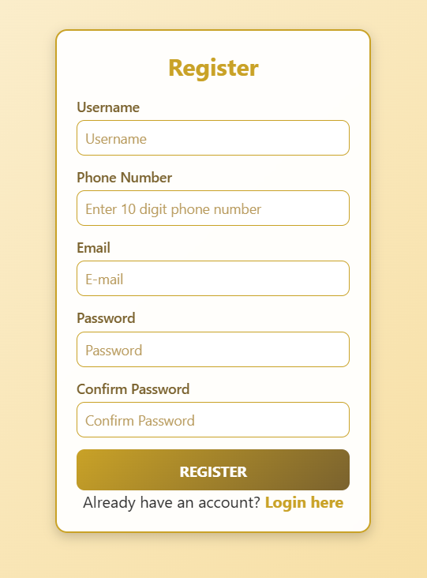
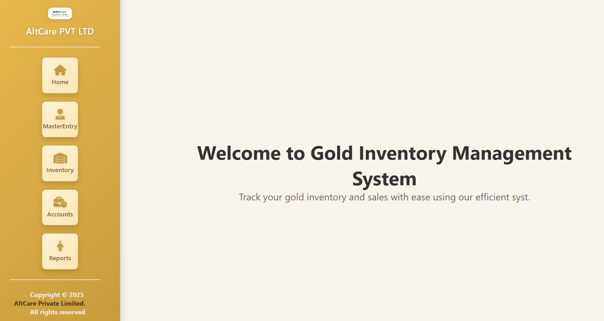
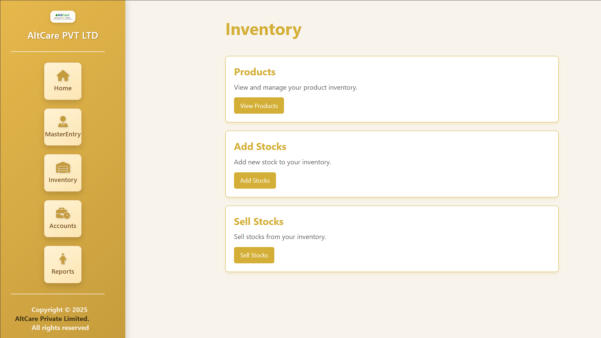
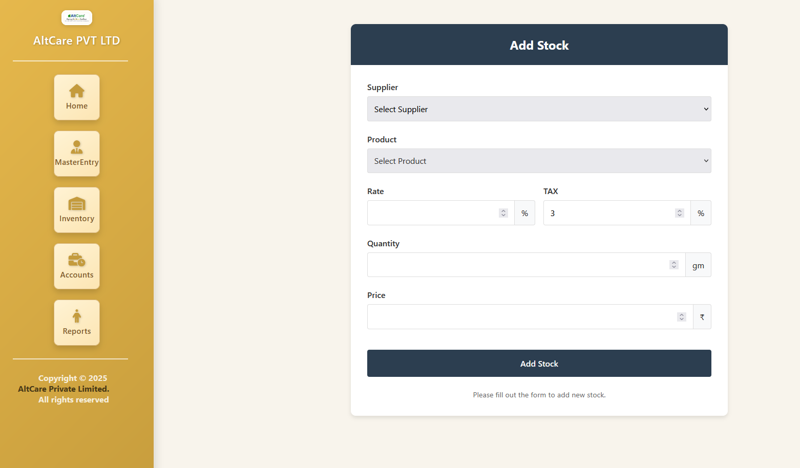
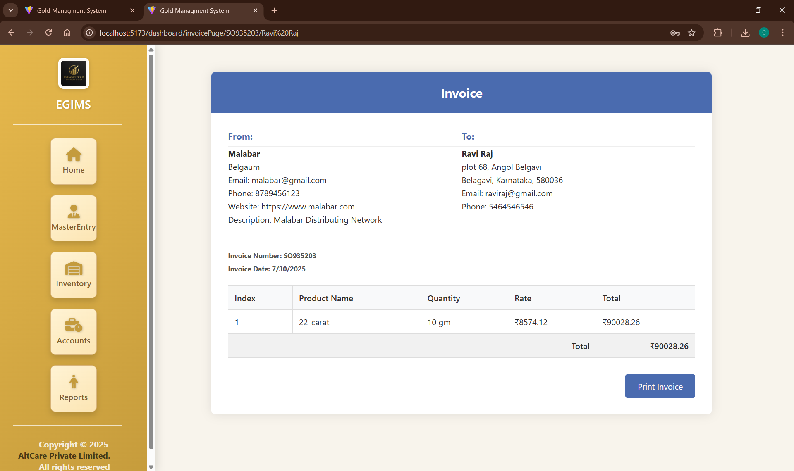

# React + Vite

This template provides a minimal setup to get React working in Vite with HMR and some ESLint rules.

Currently, two official plugins are available:

- [@vitejs/plugin-react](https://github.com/vitejs/vite-plugin-react/blob/main/packages/plugin-react/README.md) uses [Babel](https://babeljs.io/) for Fast Refresh
- [@vitejs/plugin-react-swc](https://github.com/vitejs/vite-plugin-react-swc) uses [SWC](https://swc.rs/) for Fast Refresh

## Expanding the ESLint configuration

If you are developing a production application, we recommend using TypeScript and enable type-aware lint rules. Check out the [TS template](https://github.com/vitejs/vite/tree/main/packages/create-vite/template-react-ts) to integrate TypeScript and [`typescript-eslint`](https://typescript-eslint.io) in your project.


# 🟡 Gold Inventory Management System

A full-stack web application designed for middlemen in the gold industry to efficiently manage raw gold material orders and sales for jewellers. This system streamlines inventory browsing, secure order placements, transaction management, and sales tracking.

---

## 📌 Project Modules


### 🔹 Admin Module
•	Admin registration and login.

### 🔹 Home Module
•	Profile: View and update personal or business profile details.
•	Add GST: Add and manage GST tax rates and configurations.
•	Commission: Define and update commission rates for transactions.
•	Gold Rates: Check and update the latest gold rates and market trends.

### 🔹 Master Entery Module
•	Add and manage customers.
•	Add and manage suppliers.
•	Live dashboard showing real-time counts of customers and suppliers.

### 🔹 Inventory Module
•	Products: View and manage the entire gold product inventory.
•	Add Stocks: Add new gold stocks into the system.
•	Sell Stocks: Process the sale of gold stocks from the inventory.

### 🔹 Account Module
•	Customer List: View, manage, and analyse customer data.
•	Supplier List: Manage supplier information and engagement.

### 🔹 Report Module
•	Transactions: Generate real-time transaction reports.
•	Invoice Download: Generate and print detailed invoices for transactions.

---

## 🚀 Features
- 🧾 Realtime order and sales tracking  
- 🔐 Firebase authentication for secure login  
- 📦 Inventory Products display by gold karats 
- 📊 Sales reporting and invoicing  
- 💳 Secure payment and order confirmation

---
---

## 📸 Application Screenshots

| Login Page | Registration Page |
|------------|------------------|
|  |  |

| Dashboard | Inventory |
|-----------|----------|
|  |  |

| Stock Management | Auto Invoice |
|------------------|-------------|
|  |  |

---
---
⚙️ Tech Stack

### 💻 Frontend
- React.js  
- HTML, CSS ,JavaScript


### 🗃️ Database
- Firebase Realtime Database  
- Firebase Authentication

---

## 🛠️ Installation

```bash
git clone https://github.com/your-username/gold-inventory-system.git
cd Goldproject
npm install
npm start


🔧 Firebase Setup

Go to Firebase Console
Create a new Firebase project
Enable Authentication → Sign-in method → Enable Email/Password
Enable Realtime Database → Create DB → Start in test mode
Copy your Firebase config from Project Settings
Create a firebase/firebaseConfig.js file and add:


src/
├── components/             # Reusable UI components
├── pages/                  # Page-level components (Home, Login, Dashboard, etc.)
├── firebase/
│   └── firebase.js         # Firebase setup and exports
├── App.js                  # App routes and main layout
├── index.js                # App entry point
├── styles/                 # CSS or Tailwind files


🙋‍♂️ Author
Chandan C Patil
chandanpatil32@gmail.com